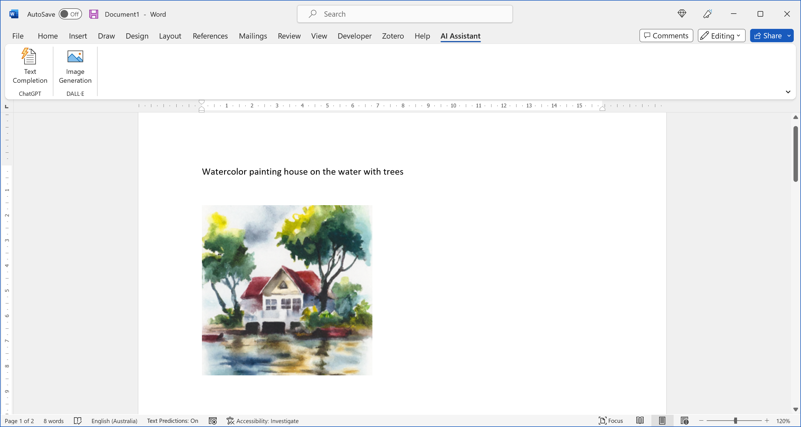
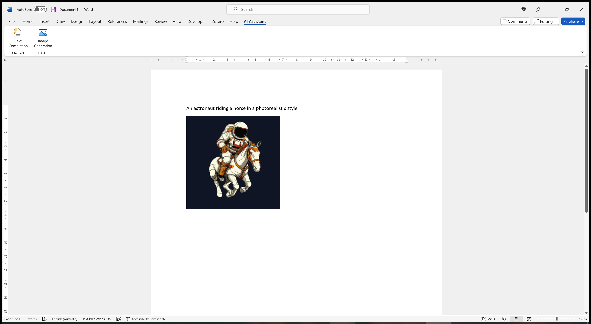
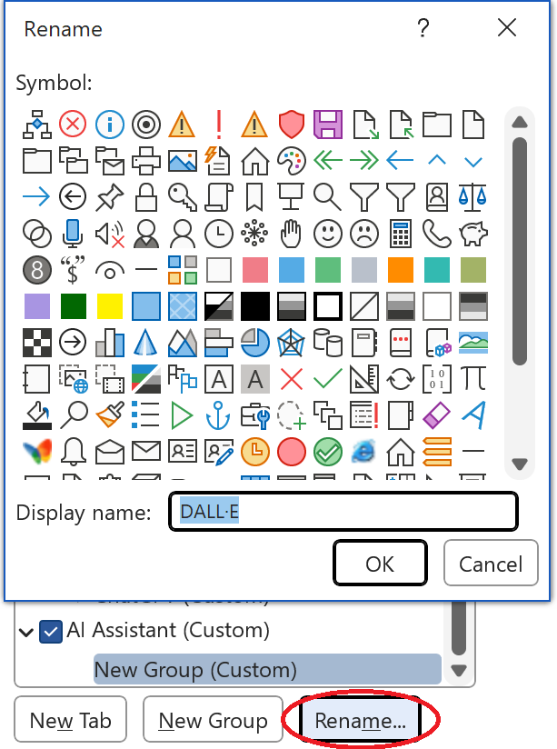
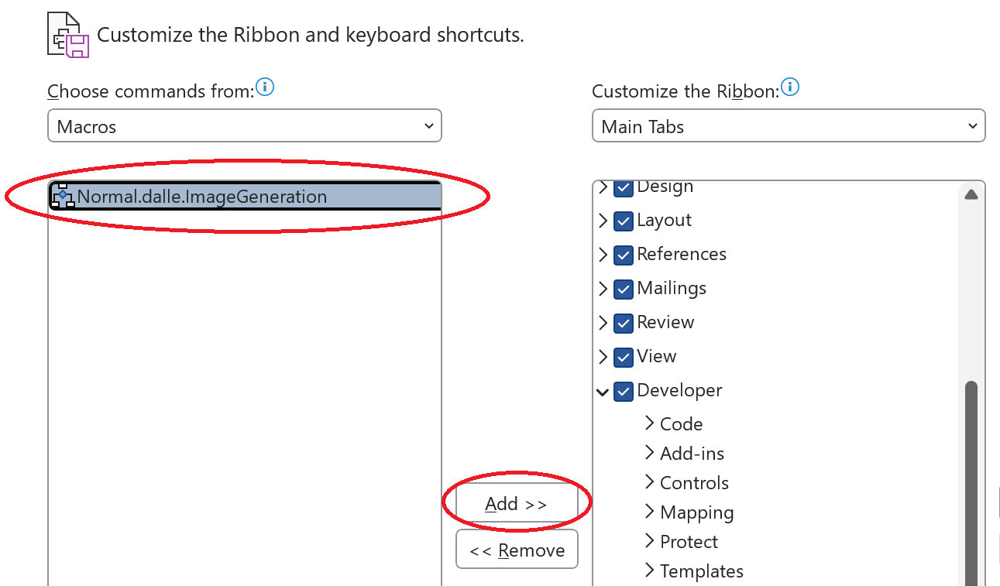
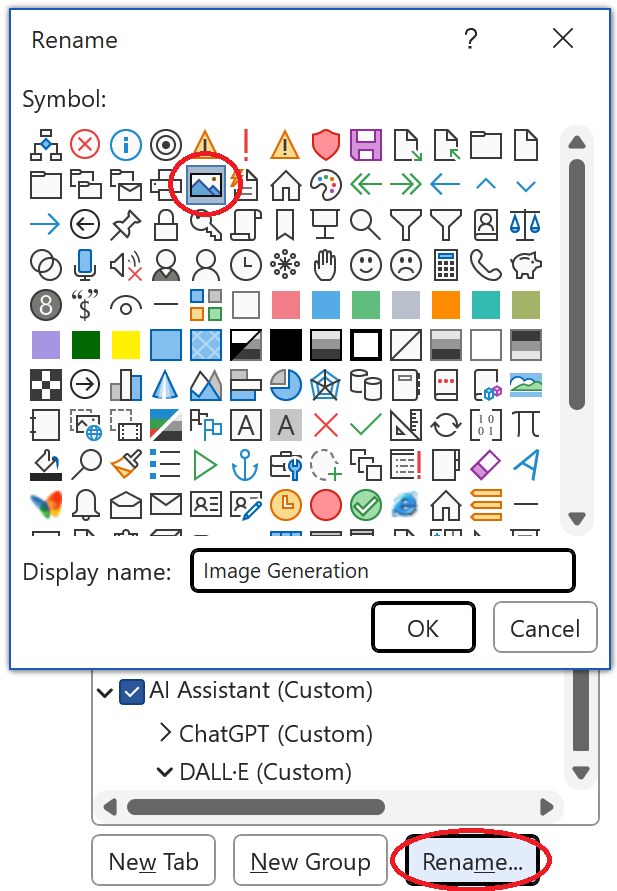
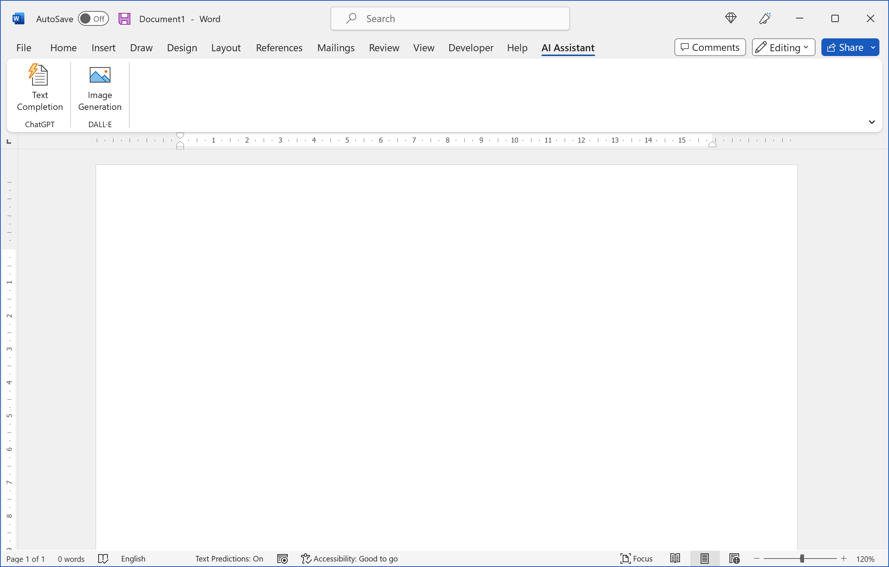

<div align="center">
 
 

  </div>

<h1 align="center">DALL·E - Create images in Microsoft Word &nbsp;</h1>


<!-- badges: start -->
<div align="center">

[](https://openai.com/dall-e-2/)&nbsp;&nbsp;
&nbsp;&nbsp;
&nbsp;&nbsp;
[](https://github.com/analyticsinmotion/chatgpt-create-images-in-microsoft-word/actions/workflows/blank.yml)&nbsp;&nbsp;
[](https://github.com/analyticsinmotion/chatgpt-images-r-shiny/blob/main/LICENSE.md)&nbsp;&nbsp;
&nbsp;&nbsp;
&nbsp;&nbsp;
[](https://openai.com)&nbsp;&nbsp;
[](https://www.analyticsinmotion.com)
 
 </div>
<!-- badges: end -->

<br />
How to add OpenAI's Image Generation capability (DALL·E 2) to Microsoft Word
<br /><br />

<!-- DESCRIPTION -->
## 1. Description

With the click of a single button you can access OpenAI's awesome capabilies to generate unique images in Microsoft Word
<br /><br />


https://user-images.githubusercontent.com/52817125/226598489-a03c1b9d-cf48-46e8-8ac9-2cd0cd18c075.mp4


<br />

<!-- GETTING STARTED -->
## 2. Getting Started
### 2.1 Dependencies
- Requires an OpenAI API Key (create an account and get API Key at <a href="https://chat.openai.com">https://chat.openai.com</a>)
- Requires Microsoft Windows 10/11 (<a href="https://www.microsoft.com/en-au/windows">https://www.microsoft.com/en-au/windows</a>)
- Requires Microsoft Word 365 (<a href="https://www.microsoft.com/en-us">https://www.microsoft.com/en-us</a>)

Please be aware of the [costs](https://openai.com/pricing) associated with using the OpenAI API when utilizing this project.

<br />

### 2.2 Download Folder for Images
All images created will be saved to the following default folder in Windows 10/11
```
C:\Users\Public\Pictures
```


<br />

### 2.3 AI Models

This application uses the following OpenAI model:
 
| Model  | Description | Iteration |
| ------------- | ------------- |------------- | 
| DALL·E  | A model that can generate and edit images given a natural <br /> language prompt. The current model has more realistic, accurate, <br /> and 4x greater resolution images than the original model. | 2nd | 

Further information about all OpenAI models can be found here: <a href="https://platform.openai.com/docs/models/overview">https://platform.openai.com/docs/models/overview</a>

We endeavour to test and integrate newer models when they are become Generally Available (GA). Models released as a 'Limited Beta' will not be integrated until they become GA.

<br />

### 2.4 OpenAI Status

Should you receive error messages for a period of 5 minutes or more, please check the Labs Uptime status at the following link: <a href="https://status.openai.com/">https://status.openai.com/</a>

<br /><br />
    
<!-- INSTRUCTIONS -->
## 3. Instructions

  - Write a desciption of the image you want DALL·E to create anywhere in Microsoft Word
  - Click the **Image Generation** button in the AI Assistant tab
  - Wait a few seconds for DALL·E to respond
  - The bespoke image will appear under the initial text descrption
<br /><br />

### 3.1 Image Generation Example 1

User Input
```
Watercolor painting house on the water with trees
```

DALL·E Output


<br />

### 3.2 Image Generation Example 2

User Input
```
An astronaut riding a horse in a photorealistic style
```

DALL·E Output


<br />

### 3.3 Top 10 Image Creation Ideas
If you are stuck for inspiration try one of these creation prompts:
```
1. Oil painting mountains and trees
2. Watercolor house by the water
3. Pointillism landscape
4. Futuristic cars
5. Mona Lisa laughing
6. An astronaut riding a horse in a photorealistic style
7. Fantasy artwork
8. Alien riding an elephant in space holding a phone
9. Painting of a kangaroo cartoon style
10. Bowl of Fruit, Violin and Bottle cubism style
```
<br />


<!-- Installation -->
## 4. Installation

There are 4 basic steps in order to add a DALL·E Image Generation button into Microsoft Word:
  1. Enable the Developer Tab
  2. Import the VBA script file
  3. Create the **Image Generation** button 
  4. Add your OpenAI APIKey
  

Each of these steps are fully outlined below. 
<br /><br />

### 4.1 Enable the Developer Tab

The Developer tab isn't displayed by default, but you can add it to the ribbon.

**Step 1** - On the File tab, go to Options > Customize Ribbon.

**Step 2** - Under Customize the Ribbon and under Main Tabs, select the Developer check box.


<br />

The latest instructions to enable the Developer Tab from Microsoft can be found here: 
<a href="https://support.microsoft.com/en-us/office/show-the-developer-tab-in-word-e356706f-1891-4bb8-8d72-f57a51146792">https://support.microsoft.com/en-us/office/show-the-developer-tab-in-word-e356706f-1891-4bb8-8d72-f57a51146792</a>
<br /><br />

### 4.2 Import the Dalle.bas file

**Step 1** - Download and Save the latest Dalle.bas file from this repository in the src/windows directory.
<br />

Keep the location of where the file is saved as you will need it later.<br />
<br />

**Step 2** - On the Developer tab, click the Visual Basic button.


<br />

**Step 3** - On the File tab, go to Import File...


<br />

**Step 4** - Select the Dalle.bas file and click Open
<br /><br />

### 4.3 Add your DALL·E Image Generation button into the Microsoft Word Ribbon

**Please Note:** This project closely relates to our *Add ChatGPT to Microsoft Word* project found here: <a href="https://github.com/analyticsinmotion/add-chatgpt-to-microsoft-word">https://github.com/analyticsinmotion/add-chatgpt-to-microsoft-word</a>. If you have have already added that project into Microsoft Word you can start at Step 3 of this section.
<br /><br />

**Step 1** - Add a new tab **(OPTIONAL)**
<br />
  - On the File tab, go to Options > Customize Ribbon
  - Click New Tab
<br />


<br />

 **Step 2** - Rename the New Tab to **AI Assistant** **(OPTIONAL)**


<br />

**Step 3** - Add New Group and rename it to **DALL·E** 


<br />

**Step 4** - Select Macros in the Choose Commands from dropdown box


<br />

**Step 5** - Select the Dalle Macro and click Add >>


<br />

**Step 6** - Rename button to **Image Generation**, select a Symbol and click OK


<br />

After the preceding steps have been completed the Microsoft Word screen should look like the following:


<br />


### 4.4 Add your OpenAI APIKey into Windows

**Step 1** - Open the Start menu and start typing "environment variables". When the best match appears click "Edit the system environment variables" result.


<br />

**Step 2** - Click the "Environment variables" button under the "Advanced" tab.


<br />

**Step 3** - Create a new user variable by clicking "New" under the "User Variables" section.


<br />

**Step 4** - Type the variable name **OPENAI_API_KEY** in the first field and your OpenAI APIKEY in the variable value field. Then click OK.


<br />

**Step 5** - **IMPORTANT** You must restart Windows to apply the new environment variable
<br /><br />


<!-- Best Practices for API Key Safety -->
## 5. Best Practices for API Key Safety

Your OpenAI APIKEY key/s should be kept secure and private at all times.

Please follow the best practices guide for API security from OpenAI 
<br />
<a href="https://help.openai.com/en/articles/5112595-best-practices-for-api-key-safety">https://help.openai.com/en/articles/5112595-best-practices-for-api-key-safety</a>
